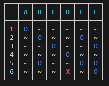
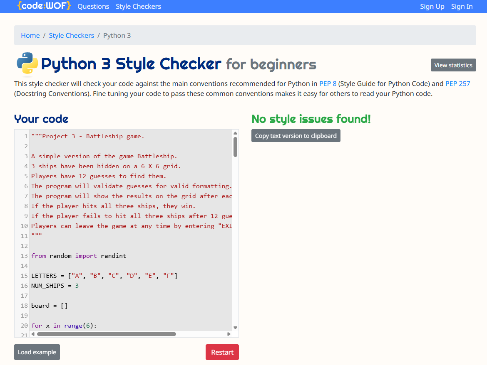

# Full Stack Development Project 3

## Python Battleship Game

This project is a simple command line Battleship game built in Python.

The computer will place 3 hidden ships on a 6 X 6 grid. 
You will then have 12 turns to try and find these ships.
If you find all three ships, you win!

## Table of contents:
1. [**Live Site**](#live-site)
1. [**Project Purpose**](#project-purpose)
    * [***Rules***](#rules)
    * [***Target Audience***](#target-audience)
    * [***User Stories***](#user-stories)
1. [**Features**](#features)
    * [***Game board***](#game-board)
    * [***Computer placed ships***](#computer-placed-ships)
    * [***Player guesses***](#player-guesses)
    * [***Hits and misses***](#hits-and-misses)
    * [***Player wins***](#player-wins)
    * [***Player loses***](#player-loses)
    * [***Exiting the game***](#exiting-the-game)
    * [***SONAR Easter egg***](#sonar-easter-egg)
1. [**Bugs**](#bugs)
1. [**Testing**](#testing)
    * [***Manual Testing***](#manual-testing)
    * [***Automated Testing***](#automated-testing)
1. [**Deployment**](#deployment)
    * [***Deployment Steps***](#deployment-steps)
1. [**Credits**](#credits)
1. [**Future Improvements**](#future-improvements)

## Live Site

https://ci-proj3-battleships-c10f2293c0bc.herokuapp.com

## Project Purpose

The purpose of this project is to create an interative Python program that allows users to play a simple version of the "Battleship" game against a computer.

### Rules

The program will hide 3 ships randomly on a 6 X 6 grid. The player then has 12 turns to guess where they are. 

- Hits are marked as an "X" on the board. Hits give players another guess without counting as a turn.
- Misses are marked with an "O". Misses end a turn.
- The player must hit all three vessels to win. 
- There is a hint in the starting instructions to increase your odds.

### Target Audience

- Fans of the game Battleship
- Fans of Python games
- Users intersted in terminal based games
- Python students

### User Stories

As a user, I want to be able to play a simple game in a terminal.
As a user, I want to be able to play Battleship against a computer.
As a user, I want to be able to guess where ships are hidden.
As a user, I want to be able to input guesses in multiple formats.
As a user, I want feedback on whether my guesses were correct or not.
As a user, I want to know how many turns are left in the game.
As a user, I want the game to let me know if my input was invalid.
As a user, I want to know if I won or lost at the end of a game.
As a user, I want a visual representation of the game. 

## Features:

The program meets these user stories by providing the following features:

### Game board

- The game is displayed on a 6 X 6 grid in the terminal. 
- The grid has letter headers across the columns, and numbers along the rows.
- "Water" is represented by "~".

If the user has the rich package installed, the board will instead be shown like this:

### Computer placed ships

- The program will place three ships on the grid at random.
- Ships cannot overlap.
- The player cannot see where the ships have been placed. 

### Player guesses

- The player then has 12 turns to guess where the ships are.
- The player enters the column and row they believe a ship is. They can enter their guess in any case, and in number/column or column/number order. 

- If a player tries to guess the same cell twice, the program will ask them to choose another.

- If a guess is invald, the program will remind the player of the required format and ask them to guess again:

- A guess will result in two outcomes:

### Hits and misses

- If a player hits a ship, the program will tell them and place an "X" on the board where the ship was. 
- Correct guesses give players another guess without counting as a turn.

- If a player misses, the program will tell them and place an "O" on the board where the incorrect guess was.

### Player wins

- If a player hits all three ships before running out of turns, the program will congratulate the player and show the board with all three hits. 
- The program will then stop.

### Player loses

- If a player fails to hit all three ships and runs out of turns, the program will let them know they have run out of turns.
- The program will then stop.

### Exiting the game

- Whilst the program will stop in the event of a win or a loss, the player can exit at any time by entering "EXIT" as a guess.

### SONAR Easter egg

- If a player enters "SONAR" as a guess, the program will reveal the location of one of the remaining ships.
- This can only be used once per game. 

## Bugs

| Title | Description | Fix | Status |
|-------|-------------|-----|--------|
| Guesses incorrectly being flagged as invalid | Even when the user enters a valid guess, it is being flagged as invalid. | Updated the get_guess function so that users can guess in a more intuitive "cell" system, i.e. A1 rather than row 1, column 1. Updated the validation rules so that validation occurs on 0 indexed versions of these guesses. | Resolved |
| Win condition set incorrectly | The win condition of the player guessing the ship's row and column was not set properly for its column, meaning that players did not have to guess the column correctly to win. | Updated "if guess_row == ship_row and guess_col" to include "== ship_col" at the end.| Resolved |
| Turn counter starts an infinite loop | The turn counter causes an infinite loop that will eventually crash the program. | The loop was caused because the turn counter was indented incorrectly. It was running when turns was less than the max amount allowed without allowing the turn counter to increase. The function is now properly indented. | Resolved |
| SONAR easter egg always reveals the exact location of a ship | The SONAR guess is intended to show the correct column of one ship, and the correct row of another. At the moment it shows the exact location of one ship instead. | Could not fix. Instead changed the feature so that it does show the exact location of a ship, but the player can only use it once per game. | Resolved, feature changed |
| Rich package fallback not working | When the Rich package was uninstalled, the program failed to fallback to the plain terminal.| Issue was a duplicate console = Console() line outside of the try: block. Removed this line. | Resolved |

## Testing

The project has been thoroughly tested, both manually and using automated tests. 

### Manual Testing

| Feature | Action | Expected Result | Actual Result | Pass/Fail |
|------|------|------|------|------|
| Ships are placed randomly and should not overlap | Play multiple games with the ship locations printed to the terminal. | Ships should appear to be placed randomly, and every game there should be three ships in unique positions on the board. | ~50 games ran. Locations varied randomly and ships never overlapped. | Pass |
| Turn counter should start from 1 and stop at 12 (unless player wins beforehand) | Start a game, and make 12 guesses. | Turn counter should show current turn and maximum number of turns. The current turn should increase by 1 after each guess. The game should stop at 12 guesses. | Turn counter shows as expected. Turn count increases by one after making a guess. Game stopped after 12 guesses. | Pass |
| Grid shows row/column headers correctly | Start a game and view the board output. | Board should display columns A–F and rows 1–6 aligned with the grid. | Board displayed as expected with A–F columns and 1–6 rows aligned. | Pass |
| Valid coordinate input accepted (letter then number) | Enter `B4` as a guess. | Input should be accepted and the game should process the guess (hit or miss). | `B4` accepted and guess processed correctly. | Pass |
| Valid coordinate input accepted (number then letter) | Enter `4B` as a guess. | Input should be accepted and treated the same as `B4`. | `4B` accepted and mapped to the same square as `B4`. | Pass |
| Coordinate input is case-insensitive | Enter `b4` as a guess. | Input should be converted to uppercase and accepted. | `b4` accepted and processed correctly. | Pass |
| Invalid coordinate format does not cost a turn | Enter invalid inputs like `BB`, `44`, `B`, `7A`, `A0`. | Game should show an error message and prompt again without incrementing the turn counter. | Errors shown and turn counter did not increase for invalid inputs. | Pass |
| Miss is marked with `O` | Make a guess that is not a ship location. | The guessed square should update from `~` to `O` and the board should re-print. | Misses were marked with `O` and board updated correctly. | Pass |
| Hit is marked with `X` | Make a guess that hits a ship location. | The guessed square should update from `~` to `X` and the board should re-print. | Hits were marked with `X` and board updated correctly. | Pass |
| Duplicate guess does not cost a turn | Guess a square, then guess the same square again. | Game should warn the player and prompt again without incrementing the turn counter. | Duplicate guess warning shown and turn counter did not increase. | Pass |
| Player wins only after hitting all 3 ships | Hit 1 or 2 ships, continue guessing, then hit the 3rd ship. | Game should continue after 1–2 hits and only display win message once all three ships are hit. | Win message only appeared after the third hit. | Pass |
| Player can use SONAR once per game | Type `SONAR` during the game, then type `SONAR` again later. | First use should display a hint. Second use should display “already used” message. Neither should cost a turn. | SONAR worked once, second attempt showed “already used”. Turn counter did not increase for SONAR. | Pass |
| SONAR hint reveals an exact ship location | Use SONAR and check the revealed coordinates with a known ship location (printed in testing mode). | Hint should reveal the exact location of a ship that has not yet been hit. | Hint provided row and column of a remaining ship. | Pass |
| EXIT command quits the game cleanly | Type `EXIT` when prompted for a guess. | Game should print an exit message and stop immediately without error. | EXIT quit the game as expected with no errors. | Pass |
| On loss, remaining ships are revealed with `S` | Intentionally lose by using all turns without hitting all ships. | Game should end, then board should re-print with any unhit ships marked as `S` (hits remain `X`, misses remain `O`). | On loss, remaining ships were shown as `S`; existing `X` and `O` markers remained correct. | Pass |
| Correct guesses give players another turn | Guess the location of a ship correctly (using SONAR). | Player should be given another guess, and the turn counter should not increase. | Following a correct guess, game asked for another guess and turn count did not increase. | Pass |
| Rich formatting shows correctly | Install rich and run the game. | Table should format with improved table formatting. | After package was installed, table was displayed with improved headers and colours for hits and misses. | Pass |
| Rich package fallback | Uninstall rich to check that program fallsback to the plain terminal. | After uninstalling rich, program ran with standard formatting. | Pass |

### Automated testing

The program was run through the code:WOF Python 3 Style Checker, which checks against the PEP 8 style guide for Python Ccode and PEP 257 docstring conventions. 

The program passed with no issues found:

## Deployment

This project was deployed using **Heroku**.

The project is available here:
- https://ci-proj3-battleships-c10f2293c0bc.herokuapp.com

The github repository is available here:
- https://github.com/gibba42/full_stack_development_project3_battleships

### Deployment Steps
1. Push final code to GitHub repository
2. Deploy `main` branch in Heroku
3. Access the live site using the URL provided

## Credits

Inspiration and help building the functions was taken from:

1. "Let's build a simple "Battleship" game from pyshine.com/Make-a-battleship-game/
2. "Python battleship program (2player or 1 player)" from Stack Exchange user Dakota Vaughn on codereview.stackexhange.com

Rich installation and formatting was helped with:

1. "Installing and Using Rich Package in Python" from geeksforgeeks.org/python/installing-and-using-rich-package-in-python/

## Future Improvements

1. Make the ships different sizes (i.e. two consecutive cells long).
2. Make the SONAR easter egg reveal the row of one remaining ship, and the column of another.
3. Add a "Play again?" loop.
4. Let the player place ships, and let the computer try and guess their location. 
