# Full Stack Development Project 3

## Python Battleship Game

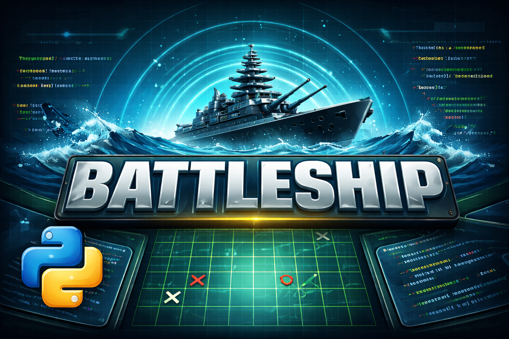

This project is a simple command line Battleship game built in Python.

## Table of contents:
1. [**Live Site**](#live-site)
1. [**Project Purpose**](#project-purpose)
    * [***Target Audience***](#target-audience)
    * [***User Stories***](#user-stories)
1. [**Features**](#features)
1. [**Bugs**](#bugs)
1. [**Testing**](#testing)
    * [***Manual Testing***](#manual-testing)
    * [***Automated Testing***](#automated-testing)
1. [**Deployment**](#deployment)
    * [***Deployment Steps***](#deployment-steps)
1. [**Credits**](#credits)
1. [**Future Improvements**](#future-improvements)

## Live Site

## Project Purpose

The purpose of this project is to create an interative Python program that allows users to play a simple version of the "Battleship" game against a computer.

## Rules

The program will hide 3 ships randomly on a 6 X 6 grid. The player then has 12 turns to guess where they are. 

- Hits are marked as an "X" on the board. 
- Misses are marked with an "O". 
- The player must hit all three vessels to win. 
- There is a hint in the starting instructions to increase your odds.

### Target Audience

### User Stories

As 

## Features:

### Game board

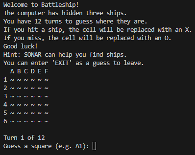

- The game is displayed on a 6 X 6 grid in the terminal. 
- The grid has letter headers across the columns, and numbers along the rows.
- "Water" is represented by "~".

### Computer placed ships

- The program will place three ships on the grid at random.
- Ships cannot overlap.
- The player cannot see where the ships have been placed. 

### Player guesses

- The player then has 12 turns to guess where the ships are.
- The player enters the column and row they believe a ship is. They can enter their guess in any case, and in number/column or column/number order. 

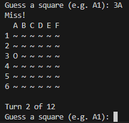

- If a player tries to guess the same cell twice, the program will ask them to choose another.

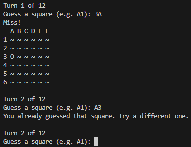

- If a guess is invald, the program will remind the player of the required format and ask them to guess again:

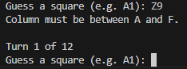
- A guess will result in two outcomes:

### Hits and misses

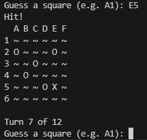
- If a player hits a ship, the program will tell them and place an "X" on the board where the ship was. 

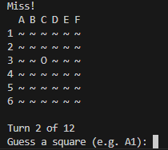
- If a player misses, the program will tell them and place an "O" on the board where the incorrect guess was.

### Player wins

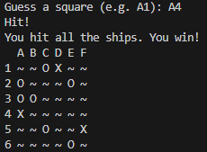
- If a player hits all three ships before running out of turns, the program will congratulate the player and show the board with all three hits. 
- The program will then stop.

### Player loses

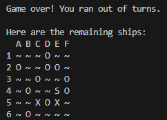
- If a player fails to hit all three ships and runs out of turns, the program will let them know they have run out of turns.
- The program will then stop.

### Exiting the game

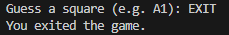
- Whilst the program will stop in the event of a win or a loss, the player can exit at any time by entering "EXIT" as a guess.

### SONAR Easter egg

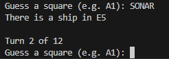
- If a player enters "SONAR" as a guess, the program will reveal the location of one of the remaining ships.
- This can only be used once per game. 

## Bugs

| Title | Description | Fix | Status |
|-------|-------------|-----|--------|
| Guesses incorrectly being flagged as invalid | Even when the user enters a valid guess, it is being flagged as invalid. | Updated the get_guess function so that users can guess in a more intuitive "cell" system, i.e. A1 rather than row 1, column 1. Updated the validation rules so that validation occurs on 0 indexed versions of these guesses. | Resolved |
| Win condition set incorrectly | The win condition of the player guessing the ship's row and column was not set properly for its column, meaning that players did not have to guess the column correctly to win. | Updated "if guess_row == ship_row and guess_col" to include "== ship_col" at the end.| Resolved |
| Turn counter starts an infinite loop | The turn counter causes an infinite loop that will eventually crash the program. | The loop was caused because the turn counter was indented incorrectly. It was running when turns was less than the max amount allowed without allowing the turn counter to increase. The function is now properly indented. | Resolved |
| SONAR easter egg always reveals the exact location of a ship | The SONAR guess is intended to show the correct column of one ship, and the correct row of another. At the moment it shows the exact location of one ship instead. | Could not fix. Instead changed the feature so that it does show the exact location of a ship, but the player can only use it once per game. | Resolved, feature changed |

## Testing

The project has been thoroughly tested, both manually and using automated tests. 

### Manual Testing

| Feature | Action | Expected Result | Actual Result | Pass/Fail |
|------|------|------|------|------|
| Ships are placed randomly and should not overlap | Play multiple games with the ship locations printed to the terminal. | Ships should appear to be placed randomly, and every game there should be three ships in unique positions on the board. | ~50 games ran. Locations varied randomly and ships never overlapped. | Pass |
| Turn counter should start from 1 and stop at 12 (unless player wins beforehand) | Start a game, and make 12 guesses. | Turn counter should show current turn and maximum number of turns. The current turn should increase by 1 after each guess. The game should stop at 12 guesses. | Turn counter shows as expected. Turn count increases by one after making a guess. Game stopped after 12 guesses. | Pass |

### Automated testing

## Deployment

This project was deployed using **GitHub Pages**.

### Deployment Steps
1. Push final code to GitHub repository
2. Navigate to **Settings → Pages**
3. Select the `main` branch as the source
4. Save and wait for deployment to complete
5. Access the live site via the provided URL

## Credits

Inspiration and help building the functions was taken from:

1. "Let's build a simple "Battleship" game from pyshine.com/Make-a-battleship-game/
2. "Python battleship program (2player or 1 player) from Stack Exchange user Dakota Vaughn on codereview.stackexhange.com

## Future Improvements

1. Make the ships different sizes (i.e. two consecutive cells long).
2. Make the SONAR easter egg reveal the row of one remaining ship, and the column of another.
3. Add a "Play again?" loop.
4. Let the player place ships, and let the computer try and guess their location. 
